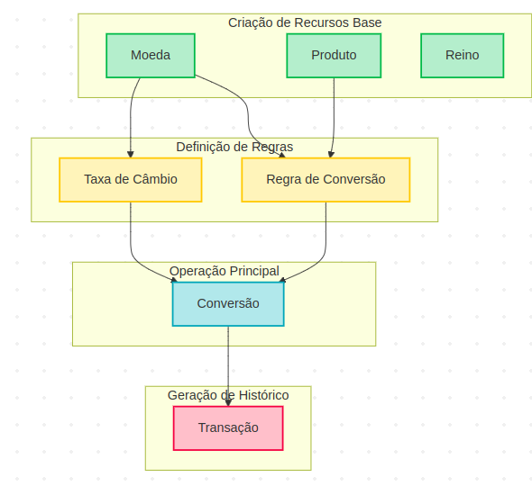
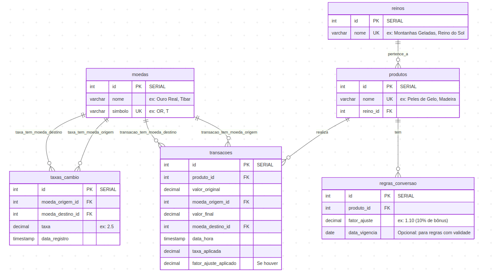

## Índice

-   [Guia de Configuração e Execução do Reino de wefin](#user-content-guia-de-configuração-e-execução-do-desafio-do-reino-de-wefin)
    
    -   [1 Pré-requisitos: Instalação de Ferramentas Essenciais](#user-content-1-pré-requisitos-instalação-de-ferramentas-essenciais)
        
        -   [1.1. Java Development Kit (JDK) 21](#user-content-11-java-development-kit-jdk-21)
            
            -   [Windows:](#user-content-windows)
                
            -   [Linux:](#user-content-linux)
                
        -   [1.2. Apache Maven 3.9.3](#user-content-12-apache-maven-393)
            
            -   [Windows:](#user-content-windows-1)
                
            -   [Linux:](#user-content-linux-1)
                
        -   [1.3. Docker e Docker Compose](#user-content-13-docker-e-docker-compose)
            
            -   [Windows:](#user-content-windows-2)
                
            -   [Linux:](#user-content-linux-2)
                
    -   [2 Clonar e Compilar a Aplicação](#user-content-2-clonar-e-compilar-a-aplicação)
        
    -   [3 Executar a Aplicação com Docker Compose](#user-content-3-executar-a-aplicação-com-docker-compose)
        
    -   [4 Acessar o PostgreSQL no Contêiner](#user-content-4-acessar-o-postgresql-no-contêiner)
        
-   [Guia da API](#user-content-guia-da-api)
    
    -   [1 Acesso à Documentação Interativa (Swagger UI)](#user-content-1-acesso-à-documentação-interativa-swagger-ui)

    -   [Guia da API SRM Wefin](#user-content-guia-da-api-srm-wefin)

    -   [Fluxo de Operações da API SRM Wefin](#user-content-fluxo-de-operações-da-api-srm-wefin)

-   [Escolhas Tecnológicas no Projeto Desafio Backend](#user-content-escolhas-tecnológicas-no-projeto-desafio-backend)
    
    -   [1\. Base do Projeto: Spring Boot e Java 21](#user-content-1-base-do-projeto-spring-boot-e-java-21)
        
    -   [2\. Dependências Essenciais (Starters do Spring Boot)](#user-content-2-dependências-essenciais-starters-do-spring-boot)
        
    -   [3\. Banco de Dados: PostgreSQL e Flyway](#user-content-3-banco-de-dados-postgresql-e-flyway)
        
    -   [4\. Ferramentas de Desenvolvimento e Teste](#user-content-4-ferramentas-de-desenvolvimento-e-teste)
        
    -   [5\. Documentação da API](#user-content-5-documentação-da-api)
        
    -   [6\. Estratégia de Build com Maven e Docker](#user-content-6-estratégia-de-build-com-maven-e-docker)
 
    -   [Diagrama ER](#user-content-diagrama-er)
 
    -   [Codigo SQL (PostgreSql)](#user-content-codigo-sql-postgresql)
        

# Guia de Configuração e Execução do Desafio do Reino de Wefin

Este documento irá guiá-lo através da configuração do ambiente de desenvolvimento, compilação do projeto com Maven, execução da aplicação e seu banco de dados PostgreSQL usando Docker Compose, e como acessar o banco de dados dentro do container.
(O código foi feito seguindo as práticas Clean Code)

## 1\. Pré-requisitos: Instalação de Ferramentas Essenciais

Vamos começar instalando as ferramentas necessárias.

---

### 1.1. Java Development Kit (JDK) 21

O Java 21 é a versão LTS (Long-Term Support) recomendada para o Spring Boot 3.x.

#### Windows:

1.  **Baixar o Instalador:** Acesse o site oficial do [Eclipse Temurin](https://adoptium.net/temurin/releases/) (recomendado por ser uma distribuição OpenJDK estável). Escolha o **JDK 21** para **Windows**, arquitetura `x64`, e baixe o instalador `.msi`.
    
2.  **Executar o Instalador:** Execute o arquivo `.msi` baixado. Siga as instruções do instalador. É geralmente recomendado manter o caminho de instalação padrão (ex: `C:\Program Files\Java\jdk-21`).
    
3.  **Configurar Variáveis de Ambiente:**
    
    -   Pressione `Win + R`, digite `sysdm.cpl` e Enter.
        
    -   Clique em **"Variáveis de Ambiente..."**.
        
    -   Na seção **"Variáveis do sistema"** (inferior):
        
        -   Clique em **"Novo..."**.
            
        -   Em "Nome da variável", digite `JAVA_HOME`.
            
        -   Em "Valor da variável", digite o caminho da sua instalação do JDK (ex: `C:\Program Files\Java\jdk-21`). Clique "OK".
            
        -   Encontre a variável `Path` (ou `PATH`), selecione-a e clique em **"Editar..."**.
            
        -   Clique em **"Novo"** e adicione `%JAVA_HOME%\bin`.
            
        -   Mova essa entrada para cima na lista, se necessário, para garantir que seja prioridade. Clique "OK" em todas as janelas.
            
4.  **Verificar a Instalação:** Abra um **novo** Prompt de Comando (CMD) ou PowerShell e digite:
    
    Bash
    
    ```
    java -version
    javac -version
    ```
    
    Você deve ver a versão do Java 21.
    

#### Linux:

1.  **Instalação Via Gerenciador de Pacotes (Recomendado - Ubuntu/Debian Exemplo):**
    
    Bash
    
    ```
    sudo apt update
    sudo apt install openjdk-21-jdk -y
    ```
    
2.  **Configurar Variáveis de Ambiente (se não for configurado automaticamente):**
    
    -   Abra seu terminal e edite o arquivo de perfil do seu shell (ex: `~/.bashrc` ou `~/.zshrc`):
        
        Bash
        
        ```
        nano ~/.bashrc # Ou ~/.zshrc se usa Zsh
        ```
        
    -   Adicione as seguintes linhas no final do arquivo (ajuste o caminho se necessário):
        
        Bash
        
        ```
        export JAVA_HOME=/usr/lib/jvm/java-21-openjdk-amd64 # Verifique o caminho exato da sua instalação
        export PATH=$JAVA_HOME/bin:$PATH
        ```
        
    -   Salve e feche o arquivo.
        
    -   Aplique as mudanças:
        
        Bash
        
        ```
        source ~/.bashrc # Ou ~/.zshrc
        ```
        
3.  **Verificar a Instalação:**
    
    Bash
    
    ```
    java -version
    javac -version
    ```
    
    Você deve ver a versão do Java 21.
    

---

### 1.2. Apache Maven 3.9.3

#### Windows:

1.  **Baixar o Binário:** Acesse o site do [Apache Maven](https://maven.apache.org/download.cgi) e baixe o arquivo `apache-maven-3.9.11-bin.zip`.
    
2.  **Extrair:** Descompacte o arquivo ZIP em um diretório de sua escolha (ex: `C:\Program Files\Apache\apache-maven-3.9.11`).
    
3.  **Configurar Variáveis de Ambiente:**
    
    -   Siga os passos 3 do JDK para abrir as "Variáveis de Ambiente".
        
    -   Na seção **"Variáveis do sistema"**:
        
        -   Clique em **"Novo..."**.
            
        -   Em "Nome da variável", digite `M2_HOME`.
            
        -   Em "Valor da variável", digite o caminho da sua instalação do Maven (ex: `C:\Program Files\Apache\apache-maven-3.9.11`). Clique "OK".
            
        -   Encontre a variável `Path` (ou `PATH`), selecione-a e clique em **"Editar..."**.
            
        -   Clique em **"Novo"** e adicione `%M2_HOME%\bin`. Clique "OK" em todas as janelas.
            
4.  **Verificar a Instalação:** Abra um **novo** Prompt de Comando (CMD) ou PowerShell e digite:
    
    Bash
    
    ```
    mvn -v
    ```
    
    Você deve ver a versão do Maven 3.9.3.
    

#### Linux:

1.  **Baixar e Extrair:**
    
    Bash
    
    ```
    wget https://archive.apache.org/dist/maven/maven-3/3.9.3/binaries/apache-maven-3.9.11-bin.tar.gz
    sudo tar -xvzf apache-maven-3.9.11-bin.tar.gz -C /opt/
    sudo mv /opt/apache-maven-3.9.11 /opt/maven
    ```
    
2.  **Configurar Variáveis de Ambiente:**
    
    -   Edite o arquivo de perfil do seu shell (ex: `~/.bashrc` ou `~/.zshrc`):
        
        Bash
        
        ```
        nano ~/.bashrc # Ou ~/.zshrc
        ```
        
    -   Adicione as seguintes linhas no final do arquivo:
        
        Bash
        
        ```
        export M2_HOME=/opt/maven
        export PATH=$M2_HOME/bin:$PATH
        ```
        
    -   Salve, feche e aplique as mudanças:
        
        Bash
        
        ```
        source ~/.bashrc # Ou ~/.zshrc
        ```
        
3.  **Verificar a Instalação:**
    
    Bash
    
    ```
    mvn -v
    ```
    
    Você deve ver a versão do Maven 3.9.11.
    

---

### 1.3. Docker e Docker Compose

#### Windows:

1.  **Baixar e Instalar Docker Desktop:** Acesse o site oficial do [Docker Desktop](https://www.docker.com/products/docker-desktop/) e baixe o instalador para Windows.
    
2.  **Executar o Instalador:** Siga as instruções. O Docker Desktop instala o Docker Engine, Docker CLI e Docker Compose. Certifique-se de habilitar o WSL 2 (Windows Subsystem for Linux 2) se for solicitado, pois ele é a forma mais performática de rodar Docker no Windows.
    
3.  **Verificar a Instalação:** Abra um novo Prompt de Comando (CMD) ou PowerShell e digite:
    
    Bash
    
    ```
    docker --version
    docker compose version
    ```
    
    Você deve ver as versões do Docker e Docker Compose.
    

#### Linux:

1.  **Instalar Docker Engine:** Siga as instruções do site oficial do Docker para sua distribuição Linux. O método recomendado geralmente envolve adicionar o repositório Docker e usar seu gerenciador de pacotes.
    
    -   **Para Ubuntu/Debian (exemplo):**
        
        Bash
        
        ```
        sudo apt update
        sudo apt install ca-certificates curl gnupg
        sudo install -m 0755 -d /etc/apt/keyrings
        curl -fsSL https://download.docker.com/linux/ubuntu/gpg | sudo gpg --dearmor -o /etc/apt/keyrings/docker.gpg
        sudo chmod a+r /etc/apt/keyrings/docker.gpg
        echo \
          "deb [arch="$(dpkg --print-architecture)" signed-by=/etc/apt/keyrings/docker.gpg] https://download.docker.com/linux/ubuntu \
          "$(. /etc/os-release && echo "$VERSION_CODENAME")" stable" | \
          sudo tee /etc/apt/sources.list.d/docker.list > /dev/null
        sudo apt update
        sudo apt install docker-ce docker-ce-cli containerd.io docker-buildx-plugin docker-compose-plugin
        ```
        
2.  **Adicionar Seu Usuário ao Grupo Docker (Recomendado):** Para executar comandos Docker sem `sudo`:
    
    Bash
    
    ```
    sudo usermod -aG docker $USER
    newgrp docker # Aplique a mudança imediatamente ou faça logout/login
    ```
    
3.  **Verificar a Instalação:**
    
    Bash
    
    ```
    docker --version
    docker compose version
    ```
    
    Você deve ver as versões do Docker e Docker Compose.
    

---

## 2\. Clonar e Compilar a Aplicação

Agora que suas ferramentas estão instaladas, vamos preparar o projeto.

1.  **Clonar o Repositório:** Abra seu terminal ou Prompt de Comando e clone o projeto:
    
    Bash
    
    ```
    git clone https://github.com/renatotn7/SRM.git
    cd SRM
    ```
    
2.  **Compilar o JAR Executável:**
    
    -   Certifique-se de que você está no diretório raiz do projeto (onde está o `pom.xml`).
        
    -   Use o Maven para limpar e empacotar a aplicação. Este comando irá compilar o código e criar um arquivo `.jar` executável na pasta `target/`.
        
    
    Bash
    
    ```
    mvn clean package
    ```
    -   Após a execução bem-sucedida, você deve encontrar o arquivo `wefin-0.0.1-SNAPSHOT.jar` dentro da pasta `target/`.
        

---

## 3\. Executar a Aplicação com Docker Compose

O Docker Compose é ideal para subir a aplicação Spring Boot e o banco de dados PostgreSQL juntos.

1.  **Certifique-se de que o Docker Desktop (Windows) ou o serviço Docker (Linux) está rodando.**
    
2.  **Navegue até o diretório raiz do projeto**  onde o `docker-compose.yml` e a pasta `target/` estão.
    
3.  **Inicie os serviços com Docker Compose:**
    
    -   Use o comando `docker compose up -d --build`.
        
    -   `-d`: Executa os contêineres em segundo plano (detached mode).
        
    -   `--build`: Garante que a imagem da sua aplicação (`app`) seja reconstruída usando o `Dockerfile`, incorporando o JAR mais recente. Isso é crucial após a compilação com Maven.
        
    
    Bash
    
    ```
    docker compose up -d --build
    ```
    
    Você verá o Docker criando as imagens (se ainda não existirem) e iniciando os contêineres `app` e `db`.
    
4.  **Verificar o Status dos Contêineres:**
    
    Bash
    
    ```
    docker ps
    ```
    
    Você deve ver `app` e `db` rodando com o status `Up`.
    
5.  **Acessar a Aplicação:** Sua aplicação Spring Boot estará disponível em `http://localhost:8081`.
    

---

## 4\. Acessar o PostgreSQL no Contêiner

Para acessar o banco de dados PostgreSQL que está rodando dentro do seu contêiner, você usará a porta que você foi mapeada no `docker-compose.yml`.

Seu `docker-compose.yml` tem:

YAML

```
  db:
    # ...
    ports:
      - "5433:5432"
```

Isso significa que a porta `5432` **dentro do contêiner `db`** está mapeada para a porta `5433` **na sua máquina host**.

Para se conectar ao PostgreSQL a partir de um cliente SQL (como pgAdmin, DBeaver, psql):

-   **Host:** `localhost` (ou `127.0.0.1`)
    
-   **Porta:** `5433`
    
-   **Nome do Banco de Dados:** `reinoSRM` (conforme configurado em `POSTGRES_DB`)
    
-   **Usuário:** `reinoSRM_user` (conforme configurado em `POSTGRES_USER`)
    
-   **Senha:** `1234567890` (conforme configurado em `POSTGRES_PASSWORD`)
    

Você pode, por exemplo, usar o cliente de linha de comando `psql` se ele estiver instalado na sua máquina:

Bash

```
psql -h localhost -p 5433 -U reinoSRM_user -d reinoSRM
```

Ele pedirá a senha (`1234567890`).

---

Com este guia, você deve conseguir configurar seu ambiente, rodar a aplicação e interagir com o banco de dados sem problemas! 

## Guia da API

Este documento detalha as funcionalidades da API "Desafio Backend", cobrindo autenticação, gerenciamento de usuários, clientes e produtos favoritos.

---

### 1\. Acesso à Documentação Interativa (Swagger UI)
Você pode acessar a documentação swagger da API para explorar todos os endpoints através desse da api interativa que quando a aplicacao estiver rodando estará disponivel em: http://localhost:8081/swagger-ui/index.html`

---
# Guia da API SRM Wefin

A API SRM Wefin fornece um conjunto de endpoints RESTful para gerenciar recursos essenciais como produtos, moedas, reinos, taxas de câmbio e regras de conversão.

## Estrutura da API

* **URL Base:** `http://localhost:8081/api/v1`
* **Formato de Dados:** JSON
* **Autenticação:** (Não implementada neste guia, mas seria feito para uso em produção).

---

## Erros

A API utiliza códigos de status HTTP padrão para indicar o resultado das operações.

| Código de Status | Descrição                                                                         |
| :--------------- | :---------------------------------------------------------------------------------- |
| `200 OK`         | A requisição foi bem-sucedida.                                                      |
| `201 Created`    | Um novo recurso foi criado com sucesso.                                             |
| `204 No Content` | A requisição foi bem-sucedida e não há conteúdo a ser retornado (e.g., exclusão).   |
| `400 Bad Request` | A requisição é inválida (e.g., dados incorretos, validação falhou).                 |
| `404 Not Found`  | O recurso solicitado não foi encontrado.                                            |
| `409 Conflict`   | A requisição não pôde ser concluída devido a um conflito (e.g., recurso duplicado).  |
| `500 Internal Server Error` | Ocorreu um erro inesperado no servidor.                                     |

---

## Endpoints

### 1. Produtos

Gerenciamento de produtos, que são utilizados nas regras de conversão.

| Método    | Caminho                   | Descrição                    | Requisição      | Resposta             |
| :-------- | :------------------------ | :--------------------------- | :-------------- | :------------------- |
| `POST`    | `/api/v1/produtos`        | Cria um novo produto.        | `ProdutoRequest`| `ProdutoResponse`    |
| `GET`     | `/api/v1/produtos`        | Lista todos os produtos.     | -               | `List<ProdutoResponse>` |
| `GET`     | `/api/v1/produtos/{id}`   | Busca um produto por ID.     | -               | `ProdutoResponse`    |
| `DELETE`  | `/api/v1/produtos/{id}`   | Deleta um produto por ID.    | -               | `204 No Content`     |

### 2. Moedas

Gerenciamento de moedas, utilizadas em todas as operações financeiras.

| Método    | Caminho                 | Descrição                | Requisição    | Resposta           |
| :-------- | :---------------------- | :----------------------- | :------------ | :----------------- |
| `POST`    | `/api/v1/moedas`        | Cria uma nova moeda.     | `MoedaRequest`| `MoedaResponse`    |
| `GET`     | `/api/v1/moedas`        | Lista todas as moedas.   | -             | `List<MoedaResponse>`|
| `GET`     | `/api/v1/moedas/{id}`   | Busca uma moeda por ID.  | -             | `MoedaResponse`    |
| `DELETE`  | `/api/v1/moedas/{id}`   | Deleta uma moeda por ID. | -             | `204 No Content`   |

### 3. Reinos

Gerenciamento de reinos, que podem ser associados a produtos.

| Método    | Caminho                 | Descrição                | Requisição    | Resposta          |
| :-------- | :---------------------- | :----------------------- | :------------ | :---------------- |
| `POST`    | `/api/v1/reinos`        | Cria um novo reino.      | `ReinoRequest`| `ReinoResponse`   |
| `GET`     | `/api/v1/reinos`        | Lista todos os reinos.   | -             | `List<ReinoResponse>`|
| `GET`     | `/api/v1/reinos/{id}`   | Busca um reino por ID.   | -             | `ReinoResponse`   |
| `DELETE`  | `/api/v1/reinos/{id}`   | Deleta um reino por ID.  | -             | `204 No Content`  |

### 4. Regras de Conversão

Gerenciamento das regras que definem o fator de ajuste entre um par de moedas e um produto.

| Método    | Caminho                 | Descrição               | Requisição            | Resposta                   |
| :-------- | :---------------------- | :---------------------- | :-------------------- | :------------------------- |
| `POST`    | `/api/v1/regras`        | Cria uma nova regra.    | `RegraConversaoRequest`| `RegraConversaoResponse` |
| `GET`     | `/api/v1/regras`        | Lista todas as regras.  | -                     | `List<RegraConversaoResponse>` |
| `DELETE`  | `/api/v1/regras/{id}`   | Deleta uma regra por ID.| -                     | `204 No Content`           |

### 5. Taxas de Câmbio

Gerenciamento das taxas de câmbio de mercado.

| Método    | Caminho                 | Descrição                                 | Requisição                                 | Resposta                 |
| :-------- | :---------------------- | :---------------------------------------- | :----------------------------------------- | :----------------------- |
| `POST`    | `/api/v1/taxas`         | Cria uma nova taxa.                       | `TaxaCambioRequest`                        | `TaxaCambioResponse`     |
| `GET`     | `/api/v1/taxas`         | Busca a taxa mais recente para um par de moedas. | Query Params: `moedaOrigem`, `moedaDestino`| `TaxaCambioResponse`     |

### 6. Transações

Busca de transações realizadas. As transações são geradas por outras operações.

| Método    | Caminho                     | Descrição                               | Requisição                                                     | Resposta                   |
| :-------- | :-------------------------- | :-------------------------------------- | :------------------------------------------------------------- | :------------------------- |
| `GET`     | `/api/v1/transacoes`        | Lista todas as transações.              | -                                                              | `List<TransacaoResponse>`  |
| `GET`     | `/api/v1/transacoes/{id}`   | Busca uma transação por ID.             | -                                                              | `TransacaoResponse`        |
| `GET`     | `/api/v1/transacoes/search` | Busca transações com filtros avançados. | Query Params: `moedaOrigemId`, `moedaDestinoId`, `dataInicial`, etc. | `List<TransacaoResponse>`  |

### 7. Conversão

Realiza a operação principal de conversão de moedas, gerando uma transação.

| Método    | Caminho                     | Descrição                              | Requisição        | Resposta             |
| :-------- | :-------------------------- | :------------------------------------- | :---------------- | :------------------- |
| `POST`    | `/api/v1/conversoes`        | Realiza a conversão de um valor. 
---

### Explicacao do fluxo do programa

# Fluxo de Operações da API SRM Wefin

Este guia detalha a sequência lógica das operações na API, começando pelos recursos básicos até a operação principal de conversão.

## 1. Criação dos Recursos Base

Primeiro, crie os blocos de construção fundamentais do sistema. Esses recursos são independentes um do outro.

* **Moedas**: Crie as moedas que serão utilizadas nas conversões (e.g., USD, EUR, Gold, Mana).
    * **Endpoint**: `POST /api/v1/moedas`
* **Produtos**: Crie os produtos que terão regras de conversão específicas (e.g., Espada Mágica, Poção de Cura).
    * **Endpoint**: `POST /api/v1/produtos`
* **Reinos**: Crie os reinos para associar a produtos ou outras entidades, se necessário.
    * **Endpoint**: `POST /api/v1/reinos`

---

## 2. Definição das Regras de Mercado e de Negócio

Com as moedas e produtos criados, você pode definir as regras que o sistema usará para as conversões.

* **Taxas de Câmbio**: Crie as taxas de câmbio de mercado entre pares de moedas. Este é o valor de referência sem nenhum ajuste.
    * **Depende de**: 2 Moedas (origem e destino).
    * **Endpoint**: `POST /api/v1/taxas`

* **Regras de Conversão**: Crie as regras de negócio que aplicam um fator de ajuste a uma taxa de câmbio, específico para um determinado produto.
    * **Depende de**: 1 Produto
    * **Endpoint**: `POST /api/v1/regras`

---

## 3. A Operação Principal: A Conversão

Com todos os dados de suporte em vigor, o fluxo principal é a conversão. Quando uma requisição de conversão é feita, o sistema executa a seguinte sequência de lógica:

* **Endpoint**: `POST /api/v1/conversoes`
* **Requisição**: Recebe o `valor` a ser convertido, o `produto` envolvido e as moedas de origem e destino.
* **Lógica do Serviço**:
    1.  O serviço busca a **taxa de câmbio mais recente** para o par de moedas especificado (`TaxaCambio`).
    2.  Em seguida, ele busca a **regra de conversão específica** para o produto e o par de moedas (`RegraConversao`).
    3.  O valor final é calculado usando a fórmula: **`Valor Convertido = Valor Original * Taxa de Câmbio * Fator de Ajuste da Regra`**.

---

## 4. Geração do Histórico

Por fim, após a conversão ser concluída com sucesso, o sistema registra a operação:

* **Geração da Transação**: O serviço de conversão cria e salva uma nova `Transacao` no banco de dados, documentando a operação realizada. Isso inclui detalhes como o valor original, o valor convertido, as moedas utilizadas, o produto, e a data/hora.

Em resumo, a ordem de dependência é: **Moedas/Produtos** -> **Taxas de Câmbio/Regras de Conversão** -> **Conversão** -> **Transação**.

segue um diagrama:

 
---

## Escolhas Tecnológicas no Projeto Desafio Backend

Este documento detalha as principais escolhas tecnológicas e dependências configuradas no arquivo `pom.xml` do projeto "Desafio SRM", explicando o racional por trás de cada uma, com foco no uso do Java 21 e na compatibilidade com Docker.

---

### 1\. Base do Projeto: Spring Boot e Java 21

O coração do projeto é o **Spring Boot**, utilizando a versão `3.3.1` do `spring-boot-starter-parent`. Essa escolha é fundamental por diversos motivos:

-   **Produtividade:** Spring Boot oferece uma experiência de desenvolvimento rápida e simplificada com auto-configuração, starters e um servidor embarcado (Tomcat por padrão), eliminando a necessidade de configurações complexas.
    
-   **Conveniência:** Facilita a criação de aplicações _stand-alone_ (autônomas) que podem ser executadas como JARs.
    
-   **Ecossistema Amplo:** Permite integrar facilmente outras bibliotecas e frameworks do ecossistema Spring.
    

A escolha do **Java 21** como a versão do JDK é estratégica:

-   **Versão LTS (Long-Term Support):** Java 21 é uma versão de suporte de longo prazo, garantindo atualizações e suporte por um período estendido, o que é ideal para projetos em produção.
    
-   **Compatibilidade com Spring Boot 3.x:** As versões 3.x do Spring Boot exigem Java 17 ou superior. O Java 21 oferece os recursos mais recentes e otimizações de performance disponíveis na plataforma Java, permitindo que o projeto aproveite ao máximo as inovações da linguagem.
    
-   **Containerização Eficiente:** O Java 21, especialmente quando usado com imagens base como `eclipse-temurin:21-jre-alpine` no Docker, é otimizado para ambientes de contêineres, resultando em imagens mais leves e inicialização mais rápida da aplicação.
    

---

### 2\. Dependências Essenciais (Starters do Spring Boot)

O `pom.xml` faz uso extensivo dos "Starters" do Spring Boot, que são conjuntos de dependências pré-configuradas para funcionalidades comuns.

-   **`mybatis**: Em vez de JPA/Hibernate, este starter habilita o uso do MyBatis. O MyBatis é um framework de mapeamento SQL que oferece um controle mais fino sobre as consultas SQL. Ele permite que você escreva SQL puro em arquivos XML ou anotações Java e mapeie os resultados diretamente para objetos Java. É uma escolha flexível para persistência, ideal quando há necessidade de otimizar consultas complexas ou interagir com stored procedures.
    
-   **`spring-boot-starter-validation`**: Adiciona suporte à validação de dados usando a Bean Validation API (JSR 380). Isso é crucial para garantir que os dados recebidos via API REST estejam em um formato e conteúdo válidos, melhorando a robustez da aplicação.
    
-   **`spring-boot-starter-web`**: Inclui todas as dependências necessárias para construir aplicações web e APIs RESTful, como Spring MVC e o servidor Tomcat embarcado. É a base para expor os endpoints da sua aplicação.
    

---

### 3\. Banco de Dados: PostgreSQL e Flyway

-   **`org.postgresql:postgresql`**: O driver JDBC para PostgreSQL. Esta dependência é marcada com `<scope>runtime</scope> no pom da aplicacão`, o que significa que ela só é necessária em tempo de execução, não durante a compilação. Isso é ideal para ambientes onde o banco de dados é externo à aplicação principal, como em um contêiner Docker separado.
    
-   **`org.flywaydb:flyway-database-postgresql`**: Integra o Flyway, uma ferramenta de _database migration_. O Flyway é essencial para gerenciar o esquema do banco de dados de forma versionada e controlada. Ele garante que as alterações no schema (criação de tabelas, modificação de colunas) sejam aplicadas de forma consistente em diferentes ambientes (desenvolvimento, teste, produção), o que é particularmente útil em um cenário de contêineres onde o banco de dados pode ser recriado ou atualizado.
    

---

### 4\. Ferramentas de Desenvolvimento e Teste

    
-   **`spring-boot-devtools`**: Uma dependência de desenvolvimento que oferece recursos como reinício rápido da aplicação e LiveReload. Embora seja útil em desenvolvimento local, ela é marcada como `<optional>true</optional>` e `<scope>runtime</scope> no pom da aplicacão`, o que significa que não será empacotada no JAR final que vai para o Docker, mantendo a imagem do contêiner mais leve e segura.
        
-   **`org.projectlombok:lombok`**: Uma biblioteca popular que reduz o código boilerplate gerando automaticamente getters, setters, construtores, métodos `equals`, `hashCode` e `toString`, além de outras funcionalidades como `@Slf4j` para logs. Melhora a legibilidade e concisão do código. A exclusão de Lombok na configuração do `spring-boot-maven-plugin` é uma boa prática para evitar conflitos potenciais ou dependências desnecessárias no JAR final, pois o próprio Maven Plugin pode reprocessar classes anotadas com Lombok.
    

---

### 5\. Documentação da API
    
-   **`org.springdoc:springdoc-openapi-starter-webmvc-ui`**: Habilita a geração automática de documentação da API no formato OpenAPI (Swagger). Isso permite que você acesse uma UI interativa (`/swagger-ui/index.html`) para testar e entender os endpoints da sua API, facilitando a integração com outros desenvolvedores e sistemas.
    

---

### 6\. Estratégia de Build com Maven e Docker


-   **`spring-boot-maven-plugin`**: Este plugin é responsável por empacotar a aplicação Spring Boot em um JAR executável. Ele cria um JAR "fat" ou "uber-JAR", que inclui todas as dependências da aplicação.
    
-   **Exclusão de Lombok na Configuração do Plugin:** A configuração `<excludes> no pom` para `lombok` dentro do plugin é uma prática recomendada. Embora Lombok seja útil em tempo de compilação para gerar código, ele não precisa estar no JAR final em tempo de execução, pois o código já foi gerado. Isso ajuda a manter o tamanho do JAR otimizado e evita possíveis problemas de classpath em ambientes de produção.
    

A arquitetura do projeto, com um JAR autônomo e o uso de `Dockerfile` para conteinerização, reflete uma abordagem moderna de desenvolvimento:

-   **Portabilidade com Docker:** O JAR final pode ser facilmente empacotado em uma imagem Docker (como visto em `Dockerfile`), que inclui um JRE mínimo (Java 21 JRE Alpine) e o JAR da aplicação. Isso garante que a aplicação execute de forma consistente em qualquer ambiente que suporte Docker, eliminando problemas de "funciona na minha máquina".
    
-   **Isolamento:** Docker oferece isolamento para a aplicação e suas dependências, incluindo o banco de dados PostgreSQL (via Docker Compose), o que simplifica o setup e o deploy.
    
-   **Desenvolvimento e Produção Similares:** O uso de Docker Compose para orquestrar a aplicação e o banco de dados em desenvolvimento espelha de perto como a aplicação será implantada em produção, reduzindo surpresas.
-   

### Diagrama ER
 


### Codigo SQL (PostgreSql)


A seguir, está o esquema (schema) do banco de dados em formato Markdown, detalhando as tabelas, seus campos, restrições e dados de exemplo.

O mesmo conteúdo abaixo(sem as marcacoes markdown) pode ser visto em [arquivo de criacao](https://github.com/renatotn7/SRM/blob/main/src/main/resources/db.migration/V1__create_tables.sql), [arquivo de inserts](https://github.com/renatotn7/SRM/blob/main/src/main/resources/db.migration/v2__inserts_padrao.sql)


---
### Tabela: `moedas`

Gerencia as moedas disponíveis no sistema, como 'Ouro Real' e 'Tibar'.

```sql
CREATE TABLE moedas (
    id INTEGER GENERATED ALWAYS AS IDENTITY PRIMARY KEY,
    nome VARCHAR(100) NOT NULL,
    simbolo VARCHAR(10) NOT NULL
);
```

---

### Tabela: `reinos`

Define os reinos existentes no universo, como o 'SRM'.

```sql
CREATE TABLE reinos (
    id INTEGER GENERATED ALWAYS AS IDENTITY PRIMARY KEY,
    nome VARCHAR(100) NOT NULL
);
```

---

### Tabela: `produtos`

Registra os produtos que pertencem a um reino.

```sql
CREATE TABLE produtos (
    id INTEGER GENERATED ALWAYS AS IDENTITY PRIMARY KEY,
    nome VARCHAR(100) NOT NULL,
    reino_id INTEGER NOT NULL
        REFERENCES reinos(id)
        ON UPDATE CASCADE
        ON DELETE RESTRICT
);
```

---

### Tabela: `regras_conversao`

Armazena regras de ajuste (bônus ou descontos) aplicáveis a cada produto.

```sql
CREATE TABLE regras_conversao (
    id INTEGER GENERATED ALWAYS AS IDENTITY PRIMARY KEY,
    produto_id INTEGER NOT NULL
        REFERENCES produtos(id)
        ON UPDATE CASCADE
        ON DELETE CASCADE,
    fator_ajuste NUMERIC(12,4) NOT NULL,
    data_vigencia DATE
);
```

---

### Tabela: `taxas_cambio`

Mantém o histórico de taxas de câmbio entre as moedas.

```sql
CREATE TABLE taxas_cambio (
    id INTEGER GENERATED ALWAYS AS IDENTITY PRIMARY KEY,
    moeda_origem_id INTEGER NOT NULL
        REFERENCES moedas(id)
        ON UPDATE CASCADE
        ON DELETE RESTRICT,
    moeda_destino_id INTEGER NOT NULL
        REFERENCES moedas(id)
        ON UPDATE CASCADE
        ON DELETE RESTRICT,
    taxa NUMERIC(18,8) NOT NULL,
    data_registro TIMESTAMP WITHOUT TIME ZONE NOT NULL DEFAULT NOW()
);
```

---

### Tabela: `transacoes`

Armazena o registro de todas as transações de conversão de produtos para moedas.

```sql
CREATE TABLE transacoes (
    id INTEGER GENERATED ALWAYS AS IDENTITY PRIMARY KEY,
    produto_id INTEGER NOT NULL
        REFERENCES produtos(id)
        ON UPDATE CASCADE
        ON DELETE RESTRICT,
    valor_original NUMERIC(18,8) NOT NULL,
    moeda_origem_id INTEGER NOT NULL
        REFERENCES moedas(id)
        ON UPDATE CASCADE
        ON DELETE RESTRICT,
    valor_final NUMERIC(18,8) NOT NULL,
    moeda_destino_id INTEGER NOT NULL
        REFERENCES moedas(id)
        ON UPDATE CASCADE
        ON DELETE RESTRICT,
    data_hora TIMESTAMP WITHOUT TIME ZONE NOT NULL DEFAULT NOW(),
    taxa_aplicada NUMERIC(18,8) NOT NULL,
    fator_ajuste_aplicado NUMERIC(12,4)
);
```

---

### Seção: Definição de Restrições (Constraints)

```sql
-- Restrições para a tabela 'moedas'
ALTER TABLE ONLY public.moedas ADD CONSTRAINT "unique_key_moedaNome" UNIQUE (nome);
ALTER TABLE ONLY public.moedas ADD CONSTRAINT "unique_key_moedaSimbolo" UNIQUE (simbolo);

-- Restrição para a tabela 'reinos'
ALTER TABLE ONLY public.reinos ADD CONSTRAINT unique_key_reino_nome UNIQUE (nome);

-- Restrição para a tabela 'produtos'
ALTER TABLE ONLY public.produtos ADD CONSTRAINT unique_key_produto_nome UNIQUE (nome);

-- Restrição para a tabela 'regras_conversao'
ALTER TABLE ONLY public.regras_conversao
    ADD CONSTRAINT uniquekey_datas_vigencias_precisao_e_produto_nao_devem_repetir_ UNIQUE (produto_id, data_vigencia);
```

---

### Seção: Dados de Exemplo (Inserts)

O trecho abaixo mostra a inserção de dados iniciais para popular o banco de dados.

```sql
-- Reino SRM
INSERT INTO reinos (nome) VALUES ('SRM');

-- Moedas: Ouro Real e Tibar
INSERT INTO moedas (nome, simbolo) VALUES ('Ouro Real', 'OR'), ('Tibar', 'T');

-- Produtos: Peles de Gelo, Madeira, Hidromel
INSERT INTO produtos (nome, reino_id)
VALUES
  ('Peles de Gelo', (SELECT id FROM reinos WHERE nome = 'SRM')),
  ('Madeira', (SELECT id FROM reinos WHERE nome = 'SRM')),
  ('Hidromel', (SELECT id FROM reinos WHERE nome = 'SRM'));

-- Taxa de câmbio inicial (1 OR = 2.5 T)
INSERT INTO taxas_cambio (moeda_origem_id, moeda_destino_id, taxa)
VALUES
  ( (SELECT id FROM moedas WHERE simbolo = 'OR'), (SELECT id FROM moedas WHERE simbolo = 'T'), 2.5 ),
  ( (SELECT id FROM moedas WHERE simbolo = 'T'), (SELECT id FROM moedas WHERE simbolo = 'OR'), ROUND(1.0 / 2.5, 8) );

-- Exemplo de transação
INSERT INTO transacoes (
  produto_id, valor_original, moeda_origem_id, valor_final, moeda_destino_id, taxa_aplicada, fator_ajuste_aplicado
) VALUES (
  (SELECT id FROM produtos WHERE nome = 'Peles de Gelo'), 10.0,
  (SELECT id FROM moedas WHERE simbolo = 'OR'), 25.0,
  (SELECT id FROM moedas WHERE simbolo = 'T'), 2.5,
  NULL
);
